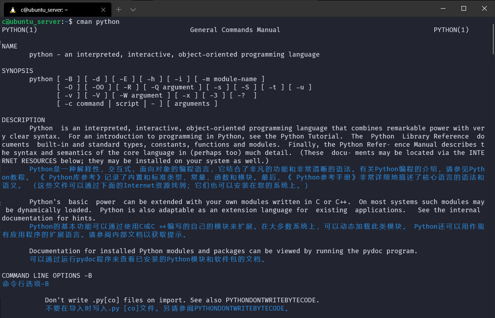

# cman
一个 Linux 命令手册（man）对照翻译工具，使用谷歌翻译（国内有效），可以替代 man 命令。

**安装**：

```bash
$ chmod 755 cman.py
$ ln cman.py /usr/local/bin/cman
```

**运行**：

```bash
$ cman <命令>
# 或者
$ cman <命令> | more
```

又在 cman.py  的基础上改写了个 chelp.py，安装方式同上：

```bash
$ chelp ls
# 相当于 ls --help 中文版
```



